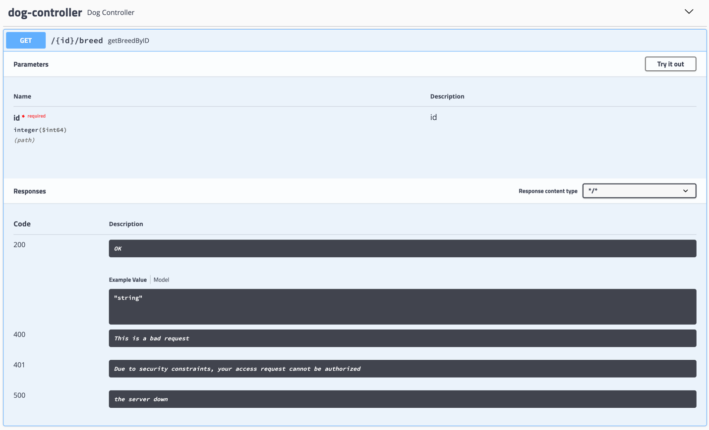

# restful API example:
1. create the project: 
   - Add the H2 Database, Spring Web Starter, and the Spring Data JPA dependencies before generating the project.
2. set up H2 in-memory database:
    - Go to application.properties Enable the console, add a path for the console, and create a url for the datasource using H2.
after set up, you can open the localhost:8082/h2 to open h2 console.
## Dog API 
1. create the dog API: [Dog.java](./src/main/java/com/udacity/RestAPIexample/entity/Dog.java)
   - @Entity:
   - @Id: as a primary key.
2. create a web controller using @RestController  [DogController.java](./src/main/java/com/udacity/RestAPIexample/web/DogController.java);
3. Step 1: Create a repository that extends CrudRepository for creating, reading, updating, and deleting Dog objects.
   - [DogRepository.java](./src/main/java/com/udacity/RestAPIexample/repository/DogRepository.java);
   - findBreedById;
   - findAllBreed;
   - findAllName;
   - use @Query annotation in spring JPA to execute both JPQL and native sql queries
4. Step 2: Create a dog service that performs the following operations:
   - retrieveDogs 
   - retrieveDogBreeds
   - retrieveDogBreedById
   - retrieveDogNames
   1. create an interface called [DogService](./src/main/java/com/udacity/RestAPIexample/service/DogService.java),
   2. create the implement of dog service [DogServiceImpl](./src/main/java/com/udacity/RestAPIexample/service/DogServiceImpl.java);
5. Step 3: Update the web controller using @RestController that handles requests for retrieving:
   - [DogController](./src/main/java/com/udacity/RestAPIexample/web/DogController.java)
   - a list of Dog breeds
   - a list of Dog breeds by Id
   - a list of Dog names
   - @RestController; [The Spring @Controller and @RestController Annotations | Baeldung](https://www.baeldung.com/spring-controller-vs-restcontroller)
   - @Autowired; [Spring注解详解_随性-CSDN博客_spring注解](https://blog.csdn.net/xyh820/article/details/7303330/) 
   - @ResponseEntity<List<Dog>>； [ResponseEntity和@ResponseBody以及@ResponseStatus区别 -解道Jdon](https://www.jdon.com/springboot/responseentity.html)
   - @PathVariable: [@PathVariable注解的用法和作用（Demo详解）_辰兮要努力-CSDN博客_pathvariable注解](https://blessing.blog.csdn.net/article/details/108814901?spm=1001.2101.3001.6650.1&utm_medium=distribute.pc_relevant.none-task-blog-2%7Edefault%7EBlogCommendFromBaidu%7ERate-1.pc_relevant_aa&depth_1-utm_source=distribute.pc_relevant.none-task-blog-2%7Edefault%7EBlogCommendFromBaidu%7ERate-1.pc_relevant_aa&utm_relevant_index=2)
6. Step 4: Make sure errors are handled appropriately.
7. Step 5: Create a data.sql file to create sample dog data in the database.
   - [data.sql](./src/main/resources/data.sql)
   - insert some initial data into the database
   - why not create the dog table?: [application.properties](./src/main/resources/application.properties)
8. Step 6: Check that you are able to access your API.
   - http://localhost:8082/h2
   
# Secure your dog API
Reuse your Dog REST API code from Lesson 2 and secure it using Basic Authentication.

- Step 1: Add the necessary dependencies for Spring Security in the Maven POM file.
    - [pom.xml](./pom.xml)
- Step 2: Create the necessary security configuration class that extends WebSecurityConfigurerAdapter to secure your API with Basic Authentication.
    - [SpringSecurityConfig](./src/main/java/com/udacity/RestAPIexample/config/SpringSecurityConfig.java)
- [EncoderConfig](./src/main/java/com/udacity/RestAPIexample/config/EncoderConfig.java): use configuration to put @bean in the Spring container 
    - fix the conflict which @Bean and @Autowired cannot put in the same class.
- Step 3: Test that your API is now secured with basic authentication and still operates appropriately for an authenticated user.
    - access the http://localhost:8082/ need name and password 
  

# Documentation:
Lab: Document Your Dog API
Reuse your Dog REST API code from Lesson 2 and document it using Swagger.

- Step 1: Add the necessary dependencies to the Maven POM file that include Springfox’s implementation of Swagger.   
   - [pom.xml](./pom.xml)
- Step 2: Configure Swagger using a Docket Bean.
   - [SwaggerConfig](./src/main/java/com/udacity/RestAPIexample/config/SwaggerConfig.java)
- 自定义状态码：
    1. [SwaggerConfig](./src/main/java/com/udacity/RestAPIexample/config/SwaggerConfig.java)关闭默认
    2. [DogController](./src/main/java/com/udacity/RestAPIexample/web/DogController.java)增加APIResponses
- Step 3: Utilize Swagger UI to review and test your API.
   - http://localhost:8082/swagger-ui.html#

    
# Test Dog API
Reuse your Dog REST API code from Lesson 2 and create unit and integration tests for it.
[在SpringBoot中使用MockMvc进行单位测试 - 简书](https://www.jianshu.com/p/13408dd4bef7)
- Step 1: Create a unit test for your API using the @WebMvcTest annotation.
  [DogControllerUnitTest](./src/test/java/com/udacity/RestAPIexample/web/DogControllerUnitTest.java)
- Step 2: Create an integration test for your API using the @SpringBootTest annotation.
  [DogControllerUnitIntegrationTest](./src/test/java/com/udacity/RestAPIexample/web/DogControllerUnitIntegrationTest.java)
- TestRestTemplate:
- assertThat:

# problem fix:
## fix plugin not found problem:
[java - Plugin 'org.springframework.boot:spring-boot-maven-plugin:' not found - Stack Overflow](https://stackoverflow.com/questions/64639836/plugin-org-springframework-bootspring-boot-maven-plugin-not-found)
```xml
<version>${project.parent.version}</version>
```
## why we need service interface?
[为什么dao层和service层要用接口？ - 简书](https://www.jianshu.com/p/64abdd29bdf6)
1. 可以在尚未实现具体Service情况下编写上层改代码,如Controller对Service的调用
2. Spring无论是AOP还是事务管理的实现都是基于动态代理的,而动态代理的实现依赖于接口,所以必须有接口的定义才能使用这些功能
3. 可以对Service进行多实现

## @Service是标记在接口上还是实现类上？
@Service注解是标注在实现类上的，因为@Service是把spring容器中的bean进行实例化，也就是等同于new操作，
只有实现类是可以进行new实例化的，而接口则不能，所以是加在实现类上的。

## .sql 相关：
名称固定：
1. 数据全部放在data.sql中
2. 创建数据表放在schema.sql中

## table Dog not found:
reference: https://stackoverflow.com/questions/67695069/spring-boot-datasource-initialization-error-with-data-sql-script-after-2-5-0-upg  

By default, data.sql scripts are now run before Hibernate is initialized.
This aligns the behavior of basic script-based initialization with that of Flyway and Liquibase.
If you want to use data.sql to populate a schema created by Hibernate,
set spring.jpa.defer-datasource-initialization to true.
While mixing database initialization technologies is not recommended,
this will also allow you to use a schema.sql script to build upon a Hibernate-created schema before it’s populated via data.sql.

## restTemplate:
[RestTemplate 最详解 - 程序员自由之路 - 博客园](https://www.cnblogs.com/54chensongxia/p/11414923.html)

## assertThat:
[(58条消息) JUnit4教程（三）：assertThat语法与Matcher_十年后的你由现在决定-CSDN博客](https://blog.csdn.net/u013001763/article/details/80256770)  
- Junit assert:
```java
public class AssertThatTest {  
    private int id = 6;  
    private boolean trueValue = true;  
    private Object nullObject = null;  
    private String msg = "Hello World";  
  
    @Test  
    public void testAssert() throws Exception {  
        assertEquals(6, id);  
        assertTrue(trueValue);  
        assertNull(nullObject);  
        assertTrue(msg != null && msg.startsWith("Hello") && msg.endsWith("World"));  
    }  
}  
```
- Junit assertThat 增强可读性
```java
public class AssertThatTest {  
    private int id = 6;  
    private boolean trueValue = true;  
    private Object nullObject = null;  
    private String msg = "Hello World!";  
  
    @Test  
    public void testAssertThat() throws Exception {  
        //由于静态导入了org.haibin369.matcher.MyMatchers.*，可以调用里面的  
        //is(), nullValue(), containsString(), startsWith()方法，可读性更好  
        assertThat(id, is(6));  
        assertThat(trueValue, is(true));  
        assertThat(nullObject, nullValue());  
        assertThat(msg, both(startsWith("Hello")).and(endsWith("World")));  
    }  
}  
```

# Failed to start bean 'documentationPluginsBootstrapper'
- This error is due to a bug in SpringFox that assumes that MVC's path matching will use the Ant-based path matcher and not the PathPattern-based matcher. 
  But in Spring Boot 2.6 the PathPattern-based is the default and this is the root cause of the error
- 又称路径匹配原则(Path Matching)。Spring MVC中的路径匹配要比标准的web.xml要灵活的多。 默认的策略实现了 org.springframework.util.AntPathMatcher，就像名字提示的那样，路径模式是使用了Apache Ant的样式路径。
    原文链接：https://blog.csdn.net/ahutdbx/article/details/82852921
